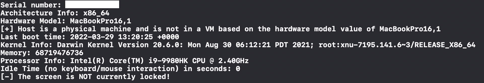

# ioreg-and-sysctl-examples
Basic examples of programmatically interacting with ioreg and sysutil in Swift to query system information. Also included the programmatic way of cheking to see if the screen is currently locked. This example queries the following information:

- Serial Number (IOServiceMatching query)
- Architecture Info (sysctlbyname query)
- Hardware Model (sysctlbyname query) - used to check whether the host is a physical machine or a VM
- Boot Time (sysctlbyname query)
- Kernel Version (sysctlbyname query)
- Memory (sysctlbyname query)
- Processor Info (sysctlbyname query)
- idle Time (IOServiceMatching query)
- Checking Whether The Screen is Locked (via CGSSessionCopyCurrentDictionary)

**Note: I have also added several of these checks into my SwiftBelt project (https://github.com/cedowens/SwiftBelt)**

